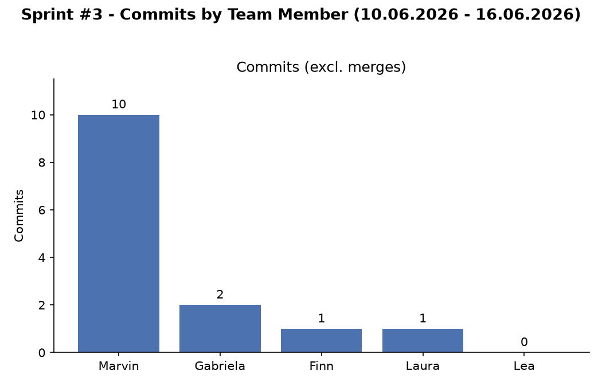

# Sprint #3 Report

**Sprint:** #3

**Status:** Abgeschlossen

**Datum:** 16.06.2026

---

## Beitragsübersicht

Das obige Diagramm zeigt die Anzahl der Commits (ohne Merges) pro Teammitglied in der
Sprint-#3-Woche (10.06.2026 - 16.06.2026). Marvin führt mit 10 Commits, gefolgt von
Gabriela (2), Finn (1) und Laura (1). Lauras Commit liegt auf ihrem Branch
`feature/prestige_UI`. Lea hat keine Commits, und Fenia hat keine und erscheint daher nicht.

---

## Zusammenfassung

| Bereich | Issues geschlossen | Issues offen | Completion Rate |
|---------|:---:|:---:|:---:|
| Frontend | 1 / 7 | 6 | 14% |
| Backend | 4 / 5 | 1 | 80% |
| **Total** | **5 / 12** | **7** | **42%** |

---

## Frontend

**Status: Weiterhin im Rückstand**

Frontend bleibt der kritische Bereich. Von den sieben Carryover-Tasks wurde diesen Sprint
nur die Prestige-UI und der Button geliefert; das Upgrades-Panel, Tutorial-Flow und -Content,
Styling und der Integration-Smoke-Test sind alle noch offen. Wie in Sprint #1 und #2 wurde
spät mit der Arbeit begonnen, obwohl dies in vergangenen Retrospektiven wiederholt
angesprochen wurde.

### Individuelle Beiträge

| Teammitglied | Erfahrungslevel | Beitrag |
|---|---|---|
| Finn | Erfahren | Supervisor; liess Gabrielas PR 5 Tage ohne Review liegen |
| Gabriela | Junior | Shape-Upgrade-Button umgesetzt |
| Laura | Junior | Prestige-UI & Button geliefert |

### Notizen
- **Laura:** hat die Prestige-UI & den Button auf ihrem Branch `feature/prestige_UI` geliefert.
  Ein paar Prozesspunkte: sie hat spät auf einem separaten Branch gepusht statt am Ende des
  Arbeitstags, was ihren Fortschritt schwerer nachvollziehbar machte; der Branch ist nun
  41 Commits hinter `main` und 3 voraus, muss also auf den aktuellen Stand gebracht, gemergt
  und nach Fertigstellung des Features gelöscht werden (gemäss PR-Workflow im Git-Dokument);
  und ihre Commit-Message folgte nicht den Conventional-Commits-Naming-Conventions. Kleine
  Punkte, aber es lohnt sich, sich darauf auszurichten.
- **Gabriela:** hat den Shape-Upgrade-Button geliefert und einen PR eröffnet, der danach
  5 Tage ohne Review lag.
- **Finn:** die 5-tägige Review-Verzögerung bei Gabrielas PR; hätte früher angeschaut werden sollen.

### Action Items
- [ ] Offene PRs innerhalb von 24-48h reviewen
- [ ] Alle Mitglieder pushen ihre Arbeit am Ende jedes Arbeitstags auf das Remote, gemäss Git-Basics-Dokument
- [ ] Feature-Branches mit `main` synchron halten und nach dem Merge löschen; Commit-Naming-Conventions befolgen
- [ ] Die verbleibenden sechs Carryover-Frontend-Issues in Sprint #4 triagen

---

## Backend

**Status: Im Plan, dank des Supervisors**

Die Backend-Lieferung sieht auf dem Papier gut aus (4 von 5 Tasks geschlossen), aber die
Zahlen verbergen ein ernstes Problem: beide zugewiesenen Juniors haben nichts geliefert,
und Marvin hat ihre Tasks übernommen, um den Bereich im Plan zu halten. Der einzige
verbleibende offene Punkt ist das Balance-Tuning, das leider vom Frontend abhängt, um ein
Gefühl für das Spiel zu bekommen.

### Individuelle Beiträge

| Teammitglied | Erfahrungslevel | Beitrag |
|---|---|---|
| Marvin | Erfahren | Supervisor; trieb die Backend-Lieferung voran und erledigte die zugewiesenen Test-Tasks beider Juniors |
| Fenia | Junior | Keine Arbeit geleistet |
| Lea | Junior | Keine Arbeit geleistet |

### Notizen
- **Fenia:** keine Arbeit, dritter Sprint in Folge.
- **Lea:** keine Arbeit, ein Rückschritt gegenüber ihrem geringfügigen Output in Sprint #2.
- **Git-Workshop:** das optionale Follow-up wurde angeboten, stiess aber auf null Anfragen der Juniors und wurde daher nicht durchgeführt.

### Action Items
- [ ] Balance-Parameter-Tuning vor Ende des nächsten Sprints abschliessen

---

## Retrospective Highlights

### Was gut lief
- Laura hat die Prestige-UI & den Button geliefert, der Hauptfortschritt im Frontend diesen Sprint
- Backend-Test-Abdeckung wurde abgeschlossen (Prestige-Tree und UpgradeNode Edge Cases)

### Was nicht gut lief
- Fenia hat den dritten Sprint in Folge keinen Output geliefert.
- Lea ist nach einem Schritt nach vorne in Sprint #2 wieder auf null Output zurückgefallen
- Gabrielas Pull Request blieb 5 Tage ohne Review und blockierte ansonsten fertige Arbeit
- Es wurde wieder spät mit der Arbeit begonnen, obwohl Timing in Sprint #1 und #2 ein Fokusbereich war
- Die End-of-Day-Push-Disziplin wurde nicht eingehalten, was die Sichtbarkeit des Fortschritts verringerte
- Frontend liegt mit seinem Carryover-Backlog weiterhin kritisch im Rückstand

### Fokusbereiche für Sprint #4
1. **Frontend Recovery (drastische Massnahme)** - alle Ressourcen ausser Marvin wechseln nächsten Sprint ins Frontend, um das Carryover-Backlog abzuarbeiten und ein spielbares Spiel zu liefern
2. **Git-Disziplin** - End-of-Day-Pushes durchsetzen, damit der Fortschritt nachvollziehbar ist
3. **Timing** - am ersten Tag mit der Arbeit beginnen, nicht spät im Sprint, wie wiederholt vereinbart

---

*Erstellt für Sprint Review | Sprint #3*
